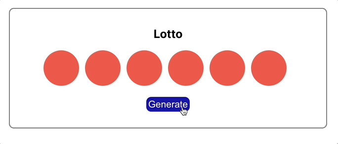

# React State LottoBall Exercise

This app generate 6 random lotto balls each time the button is clicked.

## 🎉 Demo 




## ✨ What I Have Learned

Component state commonly includes objects, arrays, and arrays of objects. It's a safe practice to update the state (especially with nested objects) by making a copy of the data structure (e.g. using `map()`), and then calling `this.setState()` with the new copy. 

When designing state, make sure to minimize the data put in the state and keep things slim. The unstateful properties should always go into props. It's also important to have a parent component to manage the state and have stateless child display components. This makes debugging easier, because the state is centralized. It’s easier to predict where to find state. 


## 💻 Setup

1️⃣ Run the command below to install packages used in the project:
```sh

$ npm install

```
2️⃣ Move into the React project:
```sh
$ cd react-state-lottoball

```

3️⃣ Run `npm start` in the terminal to start the server, and the application will automatically open up on `http//localhost:3000` in the web browser.


## 👏 Credits

This project is based on the React state tutorial of <a href="https://www.udemy.com/course/modern-react-bootcamp/">The Modern React Bootcamp</a> by Colt Steele.

The dice icons are imported from <a href="https://react-icons.github.io/react-icons">React Icons</a>.
